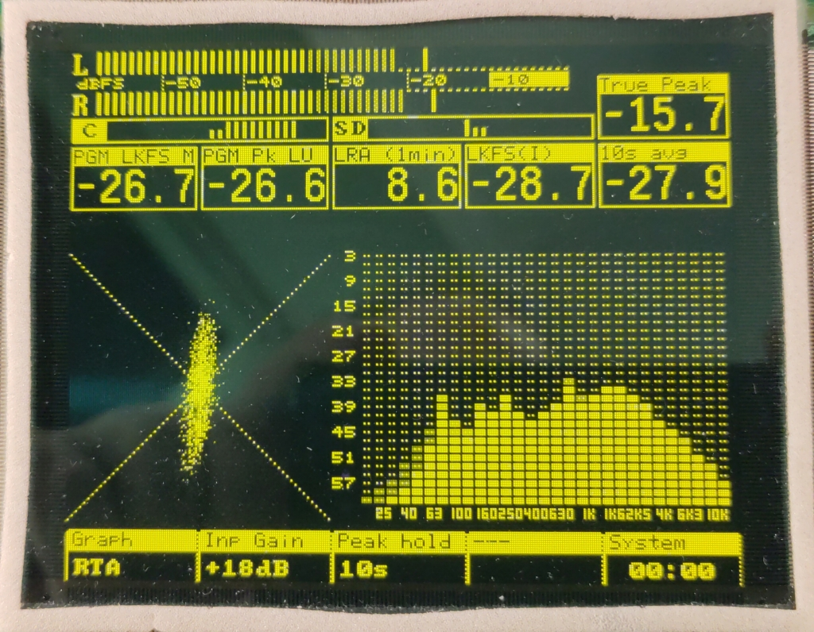

# ITU Rec. ITU-R BS.1770-2 / EBU R 128-2011 implementation on ESP32

This project implements an audio analyzer on an ESP32 with

 * AES/EBU / SPDIF digital audio input using an external digital audio receiver IC (ADC chip could be adapted as well)
 * EBU R-128 loudness meter with derived measurements:
   * LUFS(M)
   * short term average
   * gated integratedand average
   * LRA
   * stereo deviation
 * channel correlation factor
 * gonioscope
 * 31 band RTA

Display of the protoype is an EL Panel with 320x256 pixels but the code will probably support generic SPI TFT and OLED panels later on.
The final hardware design will include an optional FPGA for controllerless TFT displays.
